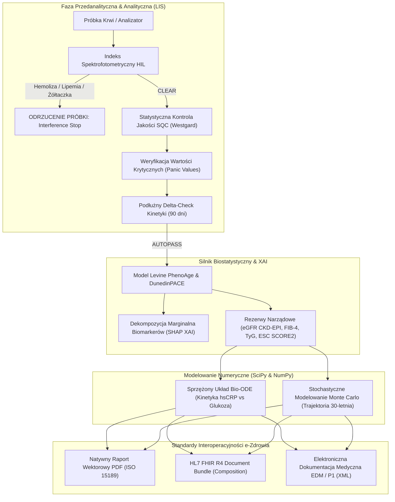

# 🧬 AeternaCore Enterprise — Clinical Longevity & LIS Diagnostic Suite
> **A Bridge Between Two Worlds: From the Laboratory Pipette to Explainable Health Intelligence.**

---

## 🏛 Executive Overview

**AeternaCore Enterprise** is an enterprise-grade clinical decision support demonstrator (**Proof-of-Concept**) engineered to bridge the critical gap between high-throughput **In Vitro Diagnostics (IVD)** and state-of-the-art **Clinical Longevity Biostatistics**. 

Built by a **Senior Medical Laboratory Technologist with 15 years of diagnostic laboratory practice**, the system addresses the prevailing "Black Box" challenge in medical AI. It prioritizes **Transparent, Auditable, and Explainable AI (XAI)** combined with rigorous automated validation rules rooted in **PN-EN ISO 15189:2023** standards.

---

## 🔬 Core Clinical Architecture

### 🧪 Real-World Clinical Edge Cases (LIS Stress-Testing)

Unlike generic sandbox calculators, **AeternaCore Enterprise** implements hard laboratory boundary rules:

* **EDTA-K2 Tube Contamination:** Catches pseudohyperkalemia ($K^+ > 8.0\text{ mmol/L}$) and secondary severe hypocalcemia ($Ca^{2+} < 1.0\text{ mmol/L}$), instantly triggering an automated sample rejection before computational corruption.
* **Acute Phase Invalidation:** Acute systemic flare-ups ($\text{hsCRP} > 30.0\text{ mg/L}$) flag the PhenoAge estimation as clinically non-evaluable to prevent false biological age spikes during active infections.
* **CPIC Pharmacogenomic Conflict:** Detects *SLCO1B1* poor metabolizers (\*5/\*5) prescribed high-dose statins (e.g., Simvastatin, Atorvastatin), recommending an immediate transition to Rosuvastatin or Ezetimibe to prevent statin-induced rhabdomyolysis.

---

### ⚖️ Regulatory, Legal & EU AI Act Compliance

> [!IMPORTANT]
> **Exploratory Scientific Demonstrator & Proof-of-Concept (PoC)**  
> This platform is strictly a research and clinical algorithm showcase. It is not intended for standalone diagnostic decision-making.

* **MDR / IVDR (EU 2017/745 & 2017/746):** This software is **NOT** a certified medical device (*Software as a Medical Device - SaMD*). It is not cleared for autonomous *in vitro* clinical diagnostics.
* **EU Artificial Intelligence Act (EU AI Act):** Qualified as a **Non-High-Risk AI / Research Demonstrator** (Art. 6 & Annex III). Features mandatory *Human-in-the-Loop* supervision and does not perform automated, binding patient triage.
* **Data Privacy (GDPR / RODO Art. 9 & 22):** Operates on a strict **in-memory stateless computing model**. No Personal Health Information (PHI) is persisted to local disks or cloud storage.
* **Clinical Governance (Polish Lab Medicine Act):** In compliance with *Ustawa z dnia 15 września 2022 r. o medycynie laboratoryjnej* (Dz.U. 2022 poz. 2280), all final laboratory result authorizations require the qualified electronic signature of a certified Laboratory Diagnostician.
---

### 👨‍🔬 About the Author: The Bridge Builder

> "Don't use AI to skip learning, use AI to accelerate it." — Mateusz Jakubowski 

Mateusz (Matthew) Jakubowski is an Experimental Biologist (M.Sc.) and Senior Medical Laboratory Technologist with over 15 years of continuous diagnostic laboratory practice at a regional clinical network. Combining laboratory bench mastery with postgraduate studies in clinical trial management and over 100 professional credentials (Stanford, Wharton, Oxford, Cambridge, Google, IBM), Mateusz operates as a Bridge Builder:

> 🚀 **Live Production Application:** [https://aeternacore-enterprise-suite.streamlit.app](https://aeternacore-enterprise-suite.streamlit.app)
* **Brand:** `#FromPipetteToPython` | `#BuildInPublic`
* **Official Portfolio:** [mateusz-jakubowski.ai.studio](https://mateusz-jakubowski.ai.studio)
* **Philosophy:** Clean code, explainable machine learning over black boxes, and unwavering humility before biological data.
